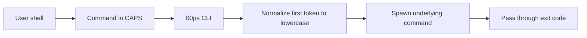

# 00PS

> Never break your shell flow just because CAPS LOCK was on.

[](https://www.npmjs.com/package/00ps)
[](https://www.npmjs.com/package/00ps)
[](LICENSE)
[](https://www.npmjs.com/package/00ps)

00PS is a tiny CLI that lets you type shell commands in CAPS LOCK and still have them run correctly. It normalizes the command name to lowercase, passes everything else through unchanged, and gets out of your way.

Part of **TheRiseCollection** and the **Rise World** developer tools ecosystem.

## The Problem

Have you ever typed a shell command with CAPS LOCK on? You get an error because `LS` doesn't exist—you meant `ls`. Or `CD` fails when you meant `cd`. This is a small but frequent frustration in daily development work.

00PS solves this by normalizing the command name to lowercase before execution.

### Who is this for?

- Terminal-heavy developers who live in shells, tmux, and dotfiles.
- SREs, DevOps, and platform engineers who run commands all day.
- Anyone who wants a little more ergonomics and forgiveness in their CLI workflow.

### Features

- **Command-only normalization** – Only the first token (the command name) is lowercased; arguments, flags, and paths are left untouched.
- **Cross-platform** – Works on macOS, Linux, and Windows (cmd.exe and PowerShell).
- **Zero configuration** – Install globally and prepend `00ps` to any command.
- **Exit-code faithful** – Mirrors the underlying command’s exit code so scripts stay predictable.

## Installation

Install globally from npm:

```bash
npm install -g 00ps
```

Yarn:

```bash
yarn global add 00ps
```

pnpm:

```bash
pnpm add -g 00ps
```

**Note**: The package is published as `00ps` (unscoped) on npm.

## Usage

Basic usage:

```bash
00ps <command> [arguments...]
```

### Quick start

```bash
# CAPS LOCK accidentally on…
00ps LS
00ps GIT STATUS
00ps NPM TEST

# Still works even if caps is off (just redundant)
00ps ls
00ps git status
```

### Examples

#### Basic commands

```bash
00ps LS
# Executes: ls

00ps PWD
# Executes: pwd
```

#### With arguments and flags

```bash
00ps LS -LA
# Executes: ls -la

00ps CD /home/user
# Executes: cd /home/user
```

#### With package managers

```bash
00ps NPM INSTALL EXPRESS
# Executes: npm install express

00ps NPM RUN BUILD
# Executes: npm run build
```

### Failure vs success

```bash
# What you typed (fails)
LS
# Shell: command not found: LS

# With 00ps (succeeds)
00ps LS
# 00ps runs: ls
```

## How It Works

00PS normalizes **only the first token** (the command name) to lowercase. All arguments, flags, and paths are passed through unchanged.

- `00ps LS -LA` → executes `ls -la`
- `00ps CD /HOME/USER` → executes `cd /HOME/USER` (path unchanged)

At a high level:



The CLI:

- Parses the first argument as the command name.
- Lowercases that command name.
- Spawns the underlying command as a child process.
- Forwards stdout, stderr, and the exit code back to your shell.

## Options

- `-h, --help` - Show help message.
- `-v, --version` - Show version number.

## Cross-Platform Support

Works on:

- Windows (cmd.exe, PowerShell)
- macOS
- Linux

On Windows:

- In **cmd.exe**, `00ps` behaves like any other CLI: it spawns the normalized command.
- In **PowerShell**, behavior is similar; commands are case-insensitive, but `00ps` still normalizes the first token for consistency.

## Limitations

- **Only the first command in a pipeline is normalized.**

  ```bash
  00ps LS | GREP src
  # 00ps runs: ls | GREP src   (only `ls` is normalized)
  ```

- **Paths are not normalized** (they may be case-sensitive depending on your OS and filesystem).

  ```bash
  00ps CD /HOME/USER
  # Command becomes: cd /HOME/USER  (path unchanged)
  ```

- **Shell built-ins work via `shell: true`** and depend on your shell environment.

## Exit Codes

- `0` - Command executed successfully.
- `1-255` - Underlying command’s exit code (passed through).
- `1` - 00PS error (invalid usage, etc.).

## Safety & Security

00PS executes commands exactly as requested after normalizing the command name. It:

- Uses `spawn` with argument arrays (not string concatenation).
- Passes arguments and environment variables through without modification.
- Does **not** change your `$PATH`, environment, or privileges.
- Does **not** execute anything you didn’t explicitly ask it to run.

Only run commands you trust—00PS just makes CAPS LOCK mistakes less painful.

## Development

```bash
# Run locally
npm start

# Basic smoke test
npm test
```

## Contributing

Contributions, ideas, and bug reports are welcome.

- Open issues and pull requests on the GitHub repository.
- Follow a simple flow: fork → branch → change → PR.
- See `PUBLISH.md` for release and publishing notes.

## Roadmap / Ideas

- Shell aliases / shortcuts for common shells.
- Optional smarter normalization modes (e.g. handling mixed-case commands).
- Quality-of-life helpers around common workflows (e.g. `git` wrappers).

## License

MIT

## Repository

[https://github.com/TheRiseCollection/00ops-plugin](https://github.com/TheRiseCollection/00ops-plugin)

---

**Maintained by [TheRiseCollection](https://github.com/TheRiseCollection)**  
Part of **[Rise World](https://riseworld.dev)** — a developer lab for building, documenting, and sharing tools.
